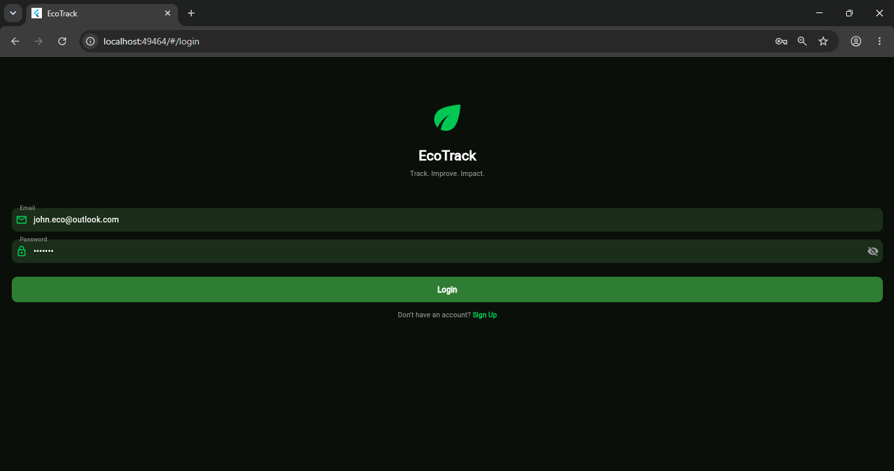
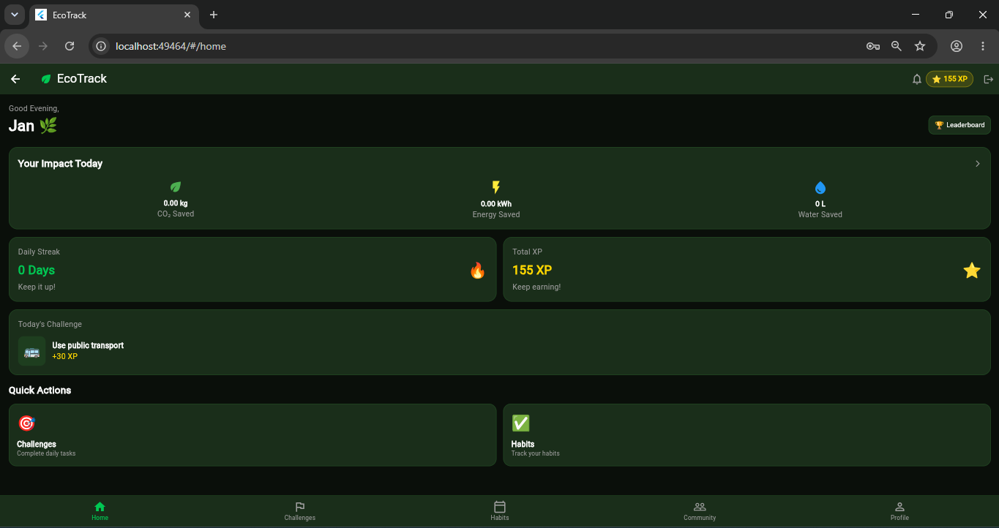
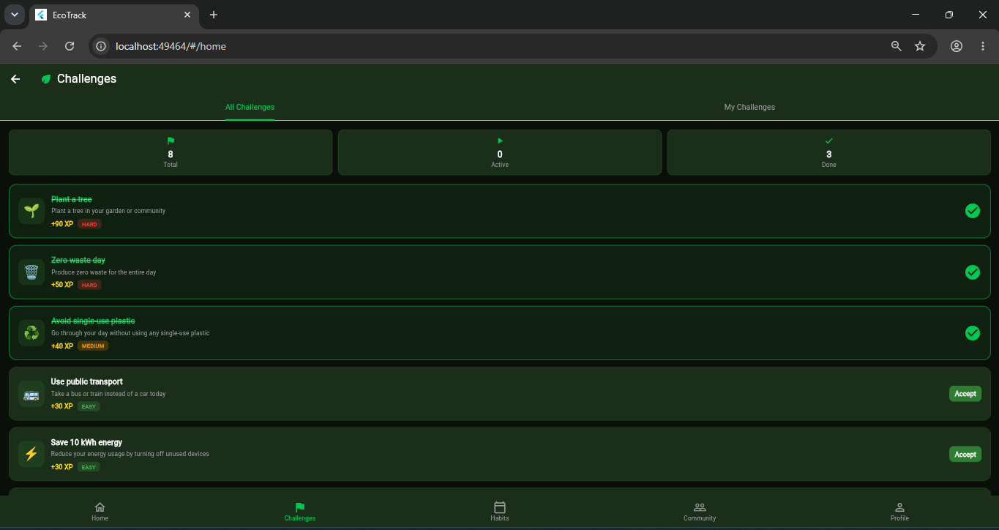
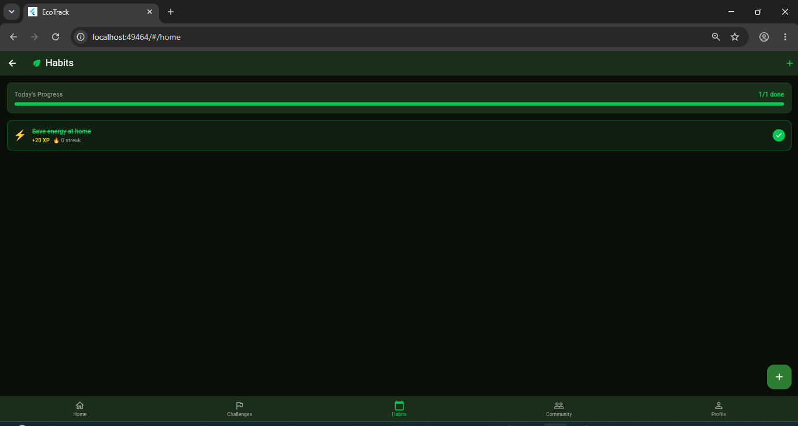
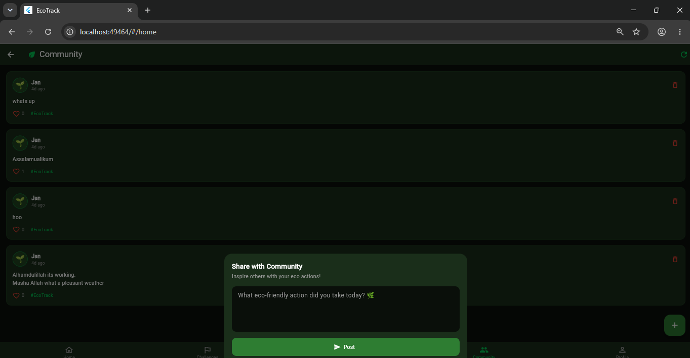
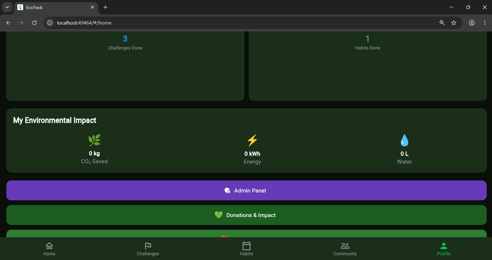
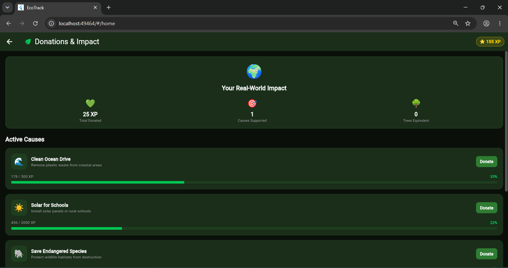
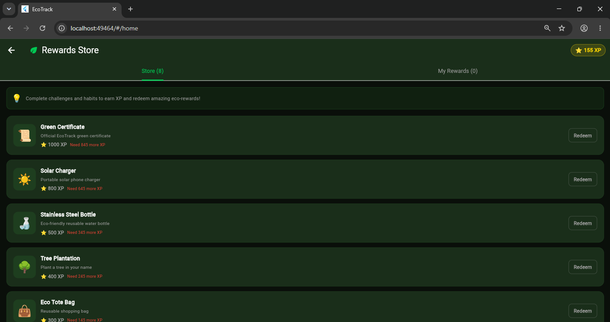
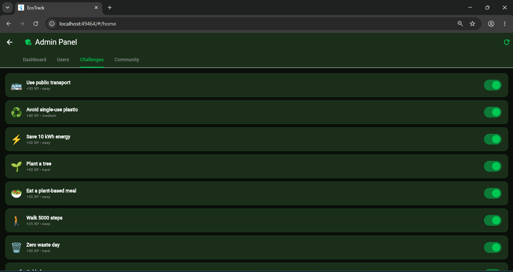
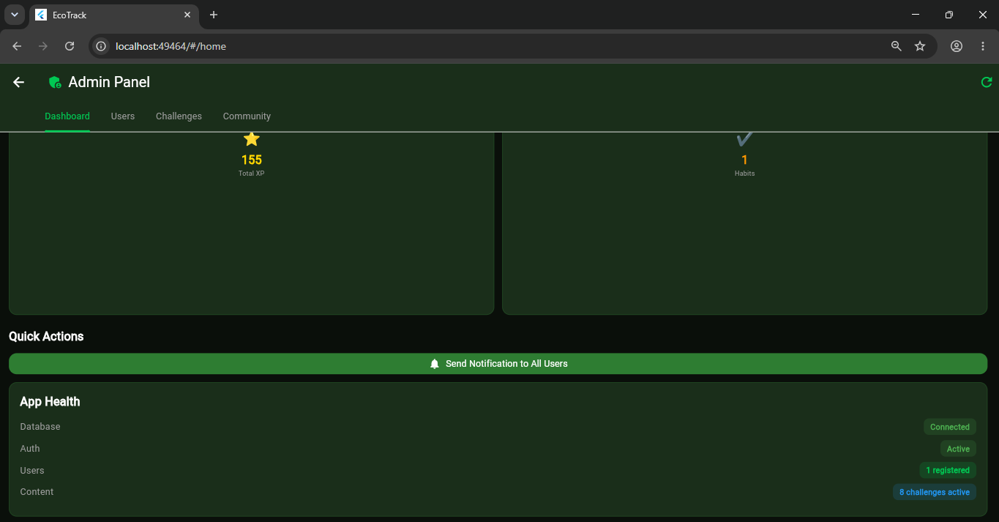

# 🌿 EcoTrack — Smart Sustainability Challenge

> **Track. Improve. Impact.**  
> A gamified sustainability mobile app built with Flutter & Supabase.


---

## 📸 Screenshots

<table>
  <tr>
    <td><p align="center"><b>Login</b></p></td>
    <td><p align="center"><b>Home Dashboard</b></p></td>
  </tr>
  <tr>
    <td><p align="center"><b>Challenges</b></p></td>
    <td><p align="center"><b>Habits</b></p></td>
  </tr>
  <tr>
    <td><p align="center"><b>Community</b></p></td>
    <td><p align="center"><b>Profile & Impact</b></p></td>
  </tr>
  <tr>
    <td><p align="center"><b>Donations & Impact</b></p></td>
    <td><p align="center"><b>Rewards Store</b></p></td>
  </tr>
  <tr>
    <td><p align="center"><b>Admin: Challenges</b></p></td>
    <td><p align="center"><b>Admin: Dashboard</b></p></td>
  </tr>
</table>

---

## 📱 About EcoTrack

EcoTrack is a production-ready sustainability mobile application that encourages
eco-friendly actions through gamification. Users can track habits, complete daily
challenges, earn XP points, compete on leaderboards, engage with a community,
redeem rewards, and support real-world environmental causes.

Built as part of the **Innovexa Catalyst Industrial Training Program — Batch 2026**.

---

## ✨ Features

### 🔐 Authentication & Onboarding
- Secure email/password signup and login
- Auto session management with Supabase Auth
- Animated splash screen with auth state detection
- User profile creation on signup

### 🏠 Dashboard & Analytics
- Personalized greeting based on time of day
- Real-time impact stats (CO₂ saved, energy, water)
- Daily streak tracker with fire animation
- Today's challenge card
- Total XP display in app bar
- Quick actions for Challenges and Habits
- Leaderboard shortcut button

### ✅ Habits Tracker
- Add eco-friendly habits from curated suggestions
- Mark habits complete with one tap
- Progress bar showing daily completion
- Streak counter per habit
- XP rewards for each habit
- Swipe to delete habits

### 🎯 Daily Challenges & Quests
- Browse all available challenges
- Accept and complete challenges
- Earn XP on completion
- Difficulty badges (Easy, Medium, Hard)
- My Challenges tab for active tracking
- Stats chips (Total, Active, Done)

### 👤 User Profile & Eco Identity
- Personal eco profile with avatar
- Dynamic eco title based on XP:
  - 🌿 Eco Newbie (0–99 XP)
  - 🌱 Green Starter (100–199 XP)
  - ⚔️ Eco Warrior (200–499 XP)
  - 🏆 Green Champion (500–999 XP)
  - 🌍 Eco Master (1000+ XP)
- Level & XP progress bar
- Stats grid (streak, XP, challenges, habits)
- Environmental impact summary

### 👥 Community & Social Feed
- Create and share eco-friendly posts
- Like and unlike posts
- Delete your own posts
- Real-time feed with time stamps
- #EcoTrack hashtag on every post

### 🏆 Leaderboard
- Global rankings by XP
- Top 3 podium with gold, silver, bronze
- "You" badge on your own entry
- Eco title and streak per user
- Your rank summary card at top

### 🎁 Rewards Store
- Browse eco-friendly rewards
- Redeem XP points for rewards
- Confirmation dialog before redemption
- "Need X more XP" hints for unaffordable rewards
- My Rewards tab for redeemed items

### 💚 Donations & Real Impact
- Support active environmental causes
- Donate XP points to causes
- Progress bars per cause
- Real-world impact summary (trees planted equivalent)
- My donations history

### 🔔 In-App Notifications
- Notification bell with unread count badge
- Mark individual notifications as read
- Mark all as read
- Swipe to delete notifications
- Auto notification on challenge completion
- Welcome notification on signup
- Admin broadcast notifications

### 🛡️ Admin Panel (Admin Only)
- **Dashboard** — app stats overview, health monitor
- **Users** — view all users, award bonus XP
- **Challenges** — toggle challenges active/inactive
- **Community** — moderate and delete posts
- **Broadcast** — send notifications to all users

---

## 🛠️ Tech Stack

| Technology | Purpose |
|---|---|
| **Flutter 3.44.1** | Cross-platform mobile framework |
| **Dart** | Programming language |
| **Supabase** | Backend (Auth, Database, Storage, Realtime) |
| **PostgreSQL** | Database (via Supabase) |
| **Row Level Security** | Data protection per user |

---

## 📁 Project Structure

```
lib/
├── main.dart                          # App entry point
├── utils/
│   └── constants.dart                 # Colors, text styles, table names
├── screens/
│   ├── splash_screen.dart             # Splash + auth check
│   ├── main_screen.dart               # Bottom navigation wrapper
│   ├── auth/
│   │   ├── login_screen.dart          # Login screen
│   │   └── signup_screen.dart         # Signup screen
│   ├── home/
│   │   └── home_screen.dart           # Dashboard screen
│   ├── habits/
│   │   └── habits_screen.dart         # Habits tracker
│   ├── challenges/
│   │   └── challenges_screen.dart     # Daily challenges
│   ├── community/
│   │   └── community_screen.dart      # Social feed
│   ├── leaderboard/
│   │   └── leaderboard_screen.dart    # Rankings
│   ├── profile/
│   │   └── profile_screen.dart        # User profile
│   ├── rewards/
│   │   └── rewards_screen.dart        # Rewards store
│   ├── donations/
│   │   └── donations_screen.dart      # Donations & impact
│   ├── notifications/
│   │   └── notifications_screen.dart  # Notifications
│   └── admin/
│       └── admin_screen.dart          # Admin panel
```

---

## 🗄️ Database Schema

| Table | Purpose |
|---|---|
| `profiles` | User profiles, XP, streaks, eco stats |
| `habits` | User habits with streaks and XP |
| `challenges` | Available eco challenges |
| `user_challenges` | Accepted/completed challenges per user |
| `posts` | Community social feed posts |
| `post_likes` | Likes per post per user |
| `rewards` | Available rewards in store |
| `user_rewards` | Redeemed rewards per user |
| `donations` | Environmental causes |
| `user_donations` | Donations made by users |
| `notifications` | In-app notifications per user |

---

## 🚀 Getting Started

### Prerequisites
- Flutter SDK 3.44.1 or higher
- Dart SDK
- Android Studio (for Android emulator)
- VS Code with Flutter & Dart extensions
- Supabase account

### Installation

**1. Clone the repository**
```bash
git clone https://github.com/yourusername/ecotrack.git
cd ecotrack
```

**2. Install dependencies**
```bash
flutter pub get
```

**3. Configure Supabase**

Create a Supabase project at https://supabase.com and update
`lib/main.dart` with your credentials:

```dart
await Supabase.initialize(
  url: 'YOUR_SUPABASE_URL',
  anonKey: 'YOUR_SUPABASE_ANON_KEY',
);
```

**4. Set up the database**

Run the SQL scripts in order in your Supabase SQL Editor:

- Create `profiles` table
- Create `habits` table
- Create `challenges` table with sample data
- Create `user_challenges` table
- Create `posts` and `post_likes` tables
- Create `rewards` table with sample data
- Create `donations` table with sample data
- Create `notifications` table with trigger
- Add `is_admin` column to profiles

**5. Run the app**
```bash
flutter run
```

### Setting Up Admin Access

To grant admin privileges to a user, run in Supabase SQL Editor:

```sql
update profiles
set is_admin = true
where id = 'YOUR_USER_ID';
```

---

## 🎨 Design System

### Color Palette
| Color | Hex | Usage |
|---|---|---|
| Primary Dark Green | `#2E7D32` | Buttons, borders |
| Primary Light Green | `#4CAF50` | Accents |
| Bright Green | `#00C853` | Active states |
| Background | `#0A0F0A` | App background |
| Surface | `#1A2E1A` | Cards |
| XP Gold | `#FFD700` | XP points |

### Typography
- Font: **Poppins** (Clean, Modern, Friendly)
- Heading: 28px Bold
- Subheading: 18px SemiBold
- Body: 14px Regular

---

## 📊 App Stats (Demo Data)

- 🌱 **11 screens** built
- 🗄️ **11 Supabase tables**
- 🎯 **8 default challenges**
- 🎁 **8 default rewards**
- 💚 **5 environmental causes**
- 🔔 Auto notifications on key actions

---

## 🛣️ Roadmap

- [ ] Android APK build & testing
- [ ] Real push notifications (FCM + OneSignal)
- [ ] Google OAuth login
- [ ] Image upload for community posts
- [ ] Weekly challenge system
- [ ] Friends & social connections
- [ ] Carbon footprint calculator
- [ ] NGO partnerships integration
- [ ] iOS support

---

## 👨‍💻 Developer

**Asad**
- Built with Flutter & Supabase
- Industrial Training Project — Innovexa Catalyst
- Batch 2026

---

## 🙏 Acknowledgements

- **Innovexa Catalyst** — for the industrial training program
- **Flutter Team** — for the amazing cross-platform framework
- **Supabase** — for the powerful open-source backend
- **Claude by Anthropic** — for guided step-by-step development support

---

## 📄 License

This project is licensed under the MIT License.

```
MIT License

Copyright (c) 2026 Asad

Permission is hereby granted, free of charge, to any person obtaining a copy
of this software and associated documentation files (the "Software"), to deal
in the Software without restriction, including without limitation the rights
to use, copy, modify, merge, publish, distribute, sublicense, and/or sell
copies of the Software, and to permit persons to whom the Software is
furnished to do so, subject to the following conditions:

The above copyright notice and this permission notice shall be included in all
copies or substantial portions of the Software.

THE SOFTWARE IS PROVIDED "AS IS", WITHOUT WARRANTY OF ANY KIND, EXPRESS OR
IMPLIED, INCLUDING BUT NOT LIMITED TO THE WARRANTIES OF MERCHANTABILITY,
FITNESS FOR A PARTICULAR PURPOSE AND NONINFRINGEMENT.
```
